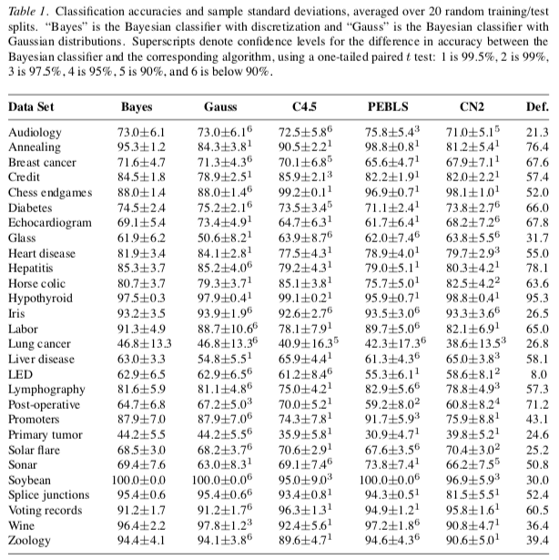
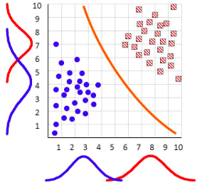

<button class="button button1"><a href="/fun/index">home</a></button>   <button class="button button2"><a href="/fun/INSTALL">install</a></button>   <button class="button button1"><a href="/fun/ABOUT">doc</a></button>   <button class="button button2"><a href="http://github.com/timm/fun/issues">discuss</a></button>    <button class="button button1"><a href="/fun/LICENSE">license</a></button> <br>


# nb.fun
## Naive Bayes Classifier

Uses:  "[funny](funny)"<br>
Uses:  "[tbl](tbl)"<br>
Uses:  "[num](num)"<br>
Uses:  "[sym](sym)"<br>


A _Naive Bayes_ classifier is a simple statistical-based learning scheme.

Advantages:

+ Tiny memory footprint
+ Simplicity
+ Often works surprisingly well
+ Fast training, fast learning
  - Better yet, it is easy to incrementally update Naive Bayes classifiers, one row
    of data at a time. 
  - The  same can not be said for other learers that must reflect
over all the data to build their models.

Assumptions:

+ Learning is done best via statistical modeling
+ Attributes are
    + equally important
    + statistically independent (given the class value)
      - This means that we only need to keep summary statistics on each column,
        rather than pairs, triples, etc of columns.
    + Which  means that knowledge about the value of a particular attribute 
      doesn't tell us anything about the value of another attribute (if the class is known)
  
Although based on assumptions that are almost never correct, this scheme works well in practice.
 Here are some performance results
of Naive Bayes versus other learners (where those other learners reflect
on attribute dependancy). Observe that Naive Bayes does pretty well:

[](http://engr.case.edu/ray_soumya/mlrg/optimality_of_nb.pdf)  

Why isn't Naive Bayes naive?
It turns other that
when  dependancies exist between attributes, then they alter the decision boundary by some
amount &Epsilon;. 
[Domingos and Pazzani](http://engr.case.edu/ray_soumya/mlrg/optimality_of_nb.pdf)  have
shown that
As the number of dimensions grows,
then the hypervolume of these &Epsilon;s shrinks to a very small fraction  of the total
attribute space. That is, the decisions made by a Naive Bayes classifier (that fretted
about dependancies) is usually the same as an optimal Bayes classifier (that took
those dependancies into account).

## How it Works

_Naive Bayes_ (here after, `Nb`) collects seperate statistics
for each class found in the training data.
Them, to classify a new example, it asks the statistics of
each class "how much do you _like_ this example?"
(where "like" means that the example is closest to the statistics
seen from that class)..
The new example gets laballed as the class that
 that "likes" it the most.

For example, here are some red and blue things.
Red things have a mean x,y value of 7,8 and blue things have a mean x,y value of 3,4.
The red line shows the "decision boundary" where we start "liking" one color
more that the other. 




More precisely, `Nb` applies Baye's Theorem to data. This theorem
says what we conclude is a product of

- what we believed before (this is called the _prior_) and 
- what evidence we see now

That is, the probability of some hypothesis _H_,
 given evidence _E_, is
 the
the probabiliy of that evidence times the probability of that evidence, given that hypotehsis. That is:

- `new = now * before`;  or, more formally, 
- `P( H|E ) = P( E|H ) * P(H)`  

To be precise, this expression should be  divided by 
_P(E)_; i.e. the probability of the evidence. But we never have to compute that since when
when  we ask "does H1 or H2 have most evidence", then we compute:
 _P( H1|E ) / P( H2|E )_. 
Since the probability of the 
evidence is the same across all hypothesis, then this _P(E)_ term
just cancels out (so we can ignore it).

To implement all this, we need to to keep statistics on all the different
hypotheses.
To that end, the `Nb` class reads rows either from some source `Tbl` or from
disk (via the `lines` function).  Internally, `Nb` maintains its
own `Tbl`s:

- One for each class seen during reading.
- One for the overall stats
 
To classify a new row, `Nb` asks each of those internal `Tbl`s how
much they `like` the new row (and the new row gets the classification
of the `Tbl` who likes it the most).

weathernom:

    outlook  temperature  humidity   windy   play
    -------  -----------  --------   -----   ----
    rainy    cool        normal    TRUE    no
    rainy    mild        high      TRUE    no
    sunny    hot         high      FALSE   no
    sunny    hot         high      TRUE    no
    sunny    mild        high      FALSE   no
    overcast cool        normal    TRUE    yes
    overcast hot         high      FALSE   yes
    overcast hot         normal    FALSE   yes
    overcast mild        high      TRUE    yes
    rainy    cool        normal    FALSE   yes
    rainy    mild        high      FALSE   yes
    rainy    mild        normal    FALSE   yes
    sunny    cool        normal    FALSE   yes
    sunny    mild        normal    TRUE    yes%%

This data can be summarized as follows:
    
               Outlook            Temperature           Humidity
    ====================   =================   =================
              Yes    No            Yes   No            Yes    No
    Sunny       2     3     Hot     2     2    High      3     4
    Overcast    4     0     Mild    4     2    Normal    6     1
    Rainy       3     2     Cool    3     1
              -----------         ---------            ----------
    Sunny     2/9   3/5     Hot   2/9   2/5    High    3/9   4/5
    Overcast  4/9   0/5     Mild  4/9   2/5    Normal  6/9   1/5
    Rainy     3/9   2/5     Cool  3/9   1/5
    
                Windy        Play
    =================    ========
          Yes     No     Yes   No
    False 6      2       9     5
    True  3      3
          ----------   ----------
    False  6/9    2/5   9/14  5/14
    True   3/9    3/5

So, what happens on a new day:

    Outlook       Temp.         Humidity    Windy         Play
    Sunny         Cool          High        True          ?%%

First find the likelihood of the two classes

+ For "yes" = 2/9 * 3/9 * 3/9 * 3/9 * 9/14 = 0.0053
+ For "no" = 3/5 * 1/5 * 4/5 * 3/5 * 5/14 = 0.0206

Conversion into a probability by normalization:

+ P("yes") = 0.0053 / (0.0053 + 0.0206) = 0.205
+ P("no") = 0.0206 / (0.0053 + 0.0206) = 0.795

So, we aren't playing golf today.

### The "low-frequencies problem"

What if an attribute value doesn't occur with every class value (e.g. "Humidity = high" for class "yes")?

+ Probability will be zero!
+ Pr[Humidity = High | yes] = 0
+ And since we are multiplying all the probabilities,
  - A posteriori probability will also be zero! Pr[ yes | E] = 0 (No matter how likely the other values are!)

So we  use an estimators for low frequency attribute ranges

+ Add a little "m" to the count for every attribute value-class combination
      + The Laplace estimator
      + Result: probabilities will never be zero.

And use an estimator for low frequency classes

+ Add a little "k" to class counts
      + The M-estimate

Magic numbers: m=2, k=1

### Handling numerics

The above assumes that the attributes are discrete. The usual approximation is to assume a "Gaussian" (i.e. a "normal" or "bell-shaped" curve) for the numerics.

The probability density function for the normal distribution is defined by the mean and standardDev (standard deviation)

+ `m` = mean
+ `s` = standard deviatopm
+ `x` = the value we are trying to score (will be maximum if `x` is the mean)

Code:

    function NumLike(i,x,      
                     var,denom,num) {
      var   = i.sd^2
      denom = (3.14159*2*var)^.5
      num   =  2.71828^(-(x-i.mu)^2/(2*var+0.0001))
      return num/(denom + 10^-64)
    } 

For example:

    outlook  temperature humidity windy play
    -------  ----------- -------- ----- ---
    sunny    85      85       FALSE no
    sunny    80      90       TRUE  no
    overcast 83      86       FALSE yes
    rainy    70      96       FALSE yes
    rainy    68      80       FALSE yes
    rainy    65      70       TRUE  no
    overcast 64      65       TRUE  yes
    sunny    72      95       FALSE no
    sunny    69      70       FALSE yes
    rainy    75      80       FALSE yes
    sunny    75      70       TRUE  yes
    overcast 72      90       TRUE  yes
    overcast 81      75       FALSE yes
    rainy    71      91       TRUE  no

This generates the following statistics:

    
                 Outlook           Temperature               Humidity
    =====================    =================      =================
               Yes    No             Yes    No            Yes      No
    Sunny       2      3             83     85             86      85
    Overcast    4      0             70     80             96      90
    Rainy       3      2             68     65             80      70
              -----------            ----------            ----------
    Sunny     2/9    3/5    mean     73     74.6  mean     79.1   86.2
    Overcast  4/9    0/5    std dev   6.2    7.9  std dev  10.2    9.7
    Rainy     3/9    2/5
    
                  Windy            Play
    ===================     ===========
               Yes   No     Yes     No
    False       6     2      9       5
    True        3     3
                -------     ----------
    False     6/9   2/5     9/14  5/14
    True      3/9   3/5

Example density value:

+ _f(temperature=66|yes)_ = `norm(66, 73, 6.2)` =0.0340

Classifying a new day:
    
        Outlook    Temp.    Humidity    Windy    Play
        Sunny      66       90          true     ?%%

+ Likelihood of "yes" = 2/9 * 0.0340 * 0.0221 * 3/9 * 9/14 = 0.000036
+ Likelihood of "no" = 3/5 * 0.0291 * 0.0380 * 3/5 * 5/14 = 0.000136
+ So:
     + P("yes") = 0.000036 / (0.000036 + 0. 000136) = 20.9%
     + P("no") = 0. 000136 / (0.000036 + 0. 000136) = 79.1%

Note: missing values during training: not included in calculation of mean and standard deviation

BTW, an alternative to the above is apply some discretization policy to the data. 
Such discretization is good practice since it can dramatically improve the performance of a Naive Bayes classifier (see [Dougherty95](http://robotics.stanford.edu/users/sahami/papers-dir/disc.pdf)).

## Code

In this code, the different ways we can `like` symbolic or numeric data is implemented in the `Num` and `Sym` class.

Here is a `Nb` payload object,
suitable for streaming over data, all the while
performing `Nb`-style classification.


```awk
   1.  function Nb(i) {
   2.    has1(i,"tbl","Tbl",1) # Tables do not keep rows (uses less memory).
   3.    has(i,"things")
   4.    i.m = THE.nb.m
   5.    i.k = THE.nb.k
   6.    i.n = -1
   7.  }
```

Here is the `Nb` training function, suitable for updating
the payoad `i` from row number `r` 
(which contains the data found in `lst`).
In this function, if we have not seen a row of this class before,
we create a new table for that class.
After that, we update the statistics in 

- the `tbl` table (which holds information on all rows)
- as well as the table for  this row's class.

# new class has to clone from old

```awk
   8.  function NbTrain(i,r,lst,   class) {
   9.    Tbl1(i.tbl,r,lst)
  10.    if(r>1) {
  11.      i.n++
  12.      class = lst[ i.tbl.my.class ]
  13.      NbEnsureClassExists(i,class) 
  14.      Tbl1(i.things[class], r,lst)
  15.    }
  16.  }
```

```awk
  17.  function NbEnsureClassExists(i,class,   head) {
  18.    if (! (class in i.things)) {
  19.      has1(i.things, class, "Tbl",1)
  20.      TblHeader(i.tbl, head)
  21.      Tbl1(i.things[class],1,head)
  22.    }
  23.  }
```
 
Here is the `Nb` classification function, that uses the payload
`i` to guess the class of row number `r`
(which contains the data found in `lst`).
To do this,  we find the  class' table that `like`s this
row the most (i.e. whose rows are most similar to `lst`).

```awk
  24.  function NbClassify(i,r,lst,    most,class,like,guess) {
  25.    most = -10^64
  26.    for(class in i.things) {
  27.      guess = guess=="" ? class : guess
  28.      like = bayestheorem( i, lst, i.n, 
  29.                                  length(i.things), 
  30.                                  i.things[class])
  31.      if (like > most) {
  32.        most  = like
  33.        guess = class
  34.    }}
  35.    return guess
  36.  }
```

The `bayestheorem` functionReturns `P( E|H ) * P(H)` where:

- `P(H)` is the prior probaility of this class,
i.e. the ratio of how often it apears in the data;
- `P( E|H )` is calcualted by multiplying together the probability
that the value in `row` column `c` belongs to the distribution seen  in column `c`.

```awk
  37.  function bayestheorem(i,lst,nall,nthings,thing,    like,prior,c,x,inc) {
  38.      like = prior = (length(thing.rows)  + i.k) / (nall + i.k * nthings)
  39.      like = log(like)
  40.      for(c in thing.my.xs) {
  41.        x = lst[c]
  42.        if (x == SKIPCOL) continue
  43.        if (c in thing.my.nums)
  44.          like += log( NumLike(thing.cols[c], x) )
  45.        else
  46.          like += log( SymLike(thing.cols[c], x, prior, i.m) )
  47.      }
  48.      return like
  49.  }
```

Note that:

- [NumLike](num.md#like) computes the likelihood by assuming the column data comes from a normal bell curve;
- [SymLike](sym.md#like) computes the likelihood by assuming the column data comes from a histogram
  of discrete values.
- Instead of multiplying probabilities, this code adds the logs of those numbers.
  This is a numerical methods trick that can assist with mutliplying together very small numbers.
- This code skips over cells with unknown values (i.e. those that match `SKIPCOL`).
- Also, the `i.k` and `nthings` variables are used to handle low freqeuncy data 
  (in the manner recommended by 
  [Yang et al.](http://citeseerx.ist.psu.edu/viewdoc/download?doi=10.1.1.72.8235&rep=rep1&type=pdf)). 


