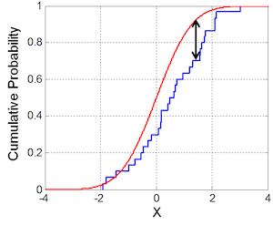

<button class="button button1"><a href="/fun/index">home</a></button>   <button class="button button2"><a href="/fun/INSTALL">install</a></button>   <button class="button button1"><a href="/fun/ABOUT">doc</a></button>   <button class="button button2"><a href="http://github.com/timm/fun/issues">discuss</a></button>    <button class="button button1"><a href="/fun/LICENSE">license</a></button> <br>


# some.fun


## Reservoir sampling (only get some of the data).


`Some` is a reservoir sampler; i.e. is a method for  randomly keep
a sample of items from a list containing items, where is either a
very large or unknown number.

Uses:  "[funny](funny)"<br>
Uses:  "[the](the)"<br>

```awk
   1.  function Some(i,c,v,     most) {
   2.    Col(i,c,v)
   3.    i.most= most ? most : THE.some.most 
   4.    has(i,"cache")             # i.cache holds the kept value
   5.    i.sorted=0
   6.    i.add="Some1"
   7.  }
```

When adding something, if full, replace anything at random.
Else, just add it. And if ever we add something, remember
that we may not be sorted anymore.

```awk
   8.  function Some1(i,v,    m) {
   9.    i.n++
  10.    m = length(i.cache)
  11.    if (m < i.most) {  # the cache is not full, add something
  12.      i.sorted = 0
  13.      return push(i.cache,v)
  14.    }
  15.    if (rand() < m/i.n) {   # else, sometimes, add "v"
  16.      i.sorted = 0
  17.      return i.cache[ int(m*rand()) + 1 ] = v
  18.    }
  19.  }
```

To sample from this distribution, just pull anything at random.

```awk
  20.  function SomeAny(i,  m) {
  21.     m= length(i.cache)
  22.     return i.cache[ int(m*rand()) + 1 ]
  23.  }
```

To compute median, ensure we are first sorted.

```awk
  24.  function SomeMedian(i) {
  25.    if (!i.sorted) i.sorted = asort(i.cache)
  26.    return median(i.cache)
  27.  }
```

IQR is the inter-quartile range and is the difference between the
75th and 25 percentile.

```awk
  28.  function SomeIQR(i,   m) {
  29.    if (!i.sorted) i.sorted = asort(i.cache)
  30.    m = int(length(i.cache)/4)
  31.    return i.cache[3*m] - i.cache[m]
  32.  }   
```

## Compare two distributions

For normal distributions, we can test if they are different using
a [t-test](nums.md). For arbitary distributions, we cannot assume
normality and must compare distributions using another method.  The
Kolmogorov–Smirnov test is a nonparametric test of the equality of
two continuous one-dimensional probability distributions. We can
use it to compare two `Some`s by

- sorted the `cache` lists
- then using the two sorted lists as two probability distributions.


Intiatively, the KS compares  a cumulative distribution against
a reference distribution (in our case, a second distribution) and 
comments on the distance between them,



As to how that is computed, the following code comes from 
[Numerical Recipes in "C"](https://github.com/txt/ase19/blob/master/etc/img/NumericalRecipesinC.pdf),
section 14.3, pages 623 to 626.  The key variable here is the _supreme distance_ (denoted below as  `d`)
 which
is the largest y-value difference between the distributons found in `i.cache`
and `j.cache`.  
If the supreme distance is small, then the distributions are the same.

```awk
  33.  function SomeKS(i,j, 
  34.                 d,d1,d2,dt,ns,fn1,fn2,k1,k2,n1,n2) {
  35.    if (!i.sorted) i.sorted = asort(i.cache)
  36.    if (!j.sorted) j.sorted = asort(j.cache)
  37.    n1= length(i.cache)
  38.    n2= length(j.cache)   
  39.    k1=k2=1
  40.    while (k1 <= n1 && k2 <= n2) {
  41.      if ((d1=i.cache[k1]) <= (d2=j.cache[k2])) {
  42.        do {
  43.          fn1=k1/n1;
  44.          k1++
  45.        } while (k1 <= n1 && d1 == i.cache[k1]);
  46.      }
  47.      if (d2 <= d1) {
  48.        do  {
  49.          fn2=k2/n2;
  50.          k2++
  51.        } while (k2 <= n2 && d2 == j.cache[k2]);
  52.      }
  53.      if ((dt=abs(fn2-fn1)) > d) d=dt;
  54.    }
  55.    ns=sqrt(n1*n2/(n1+n2));
  56.    return _SomeProbks(2.718281828, 0.001, 10^-8,
  57.             (ns+0.12+0.11/ns)*d) <= (1-THE.some.ks/100) 
  58.  }
```

The significance that `d` disproofs that the
distributions are the same is computed from the `SomeKS` function.
In the following, the _smaller_ the value returned from `SomeKS`,
the _more_ likely that the distributions are different.

```awk
  59.  function _SomeProbks(e,eps1,eps2,alam,    
  60.                      a2,fac,sum,term,termbf,j) {
  61.     fac=2   
  62.     a2 = -2*alam*alam
  63.     for(j=1;j<=100;j++) {
  64.        term = fac*e^(a2*j*j)
  65.        sum += term
  66.        if (abs(term) <= eps1*termbf) return sum
  67.        if (abs(term) <= eps2*sum)    return sum
  68.        fac *= -1
  69.        termbf = abs(term)
  70.    }
  71.    return 1
  72.  }
```
